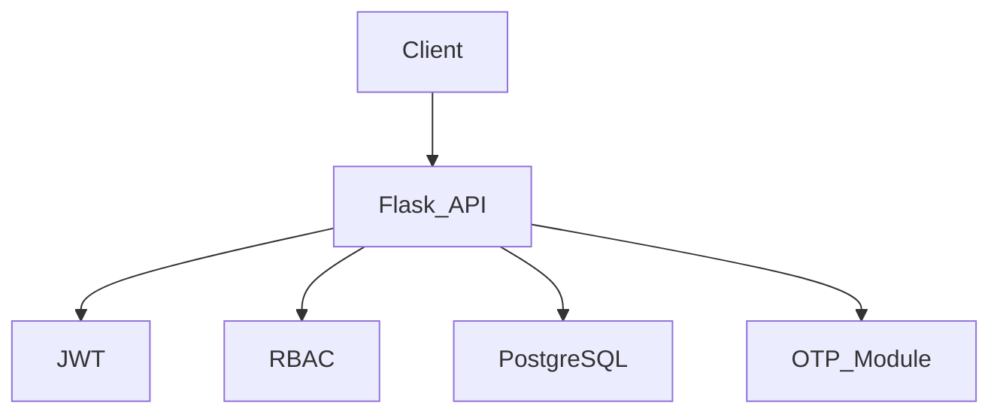
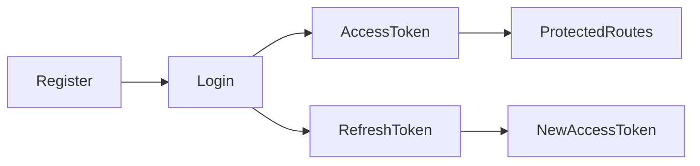
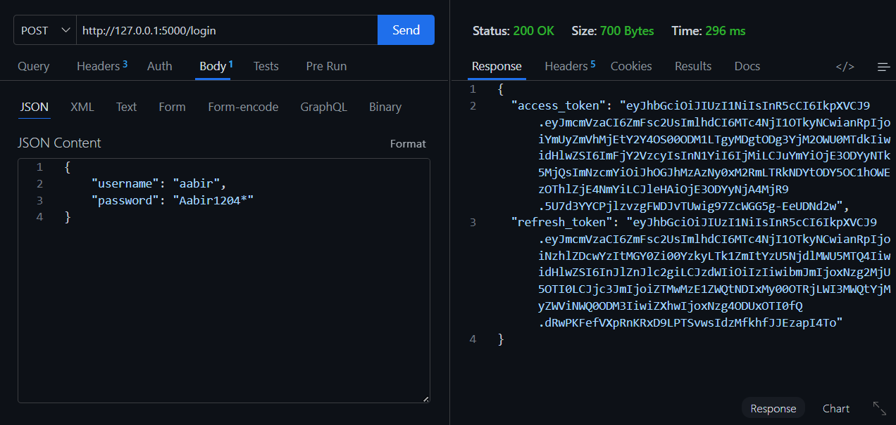
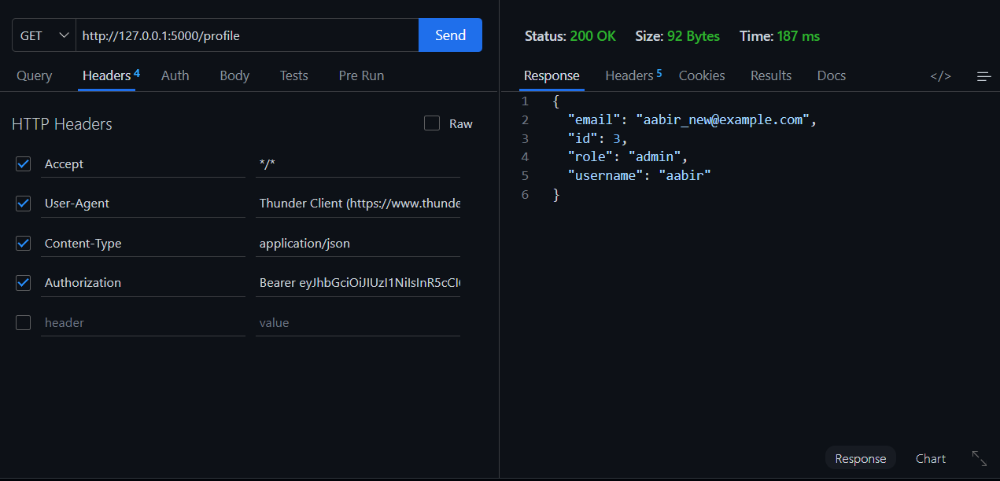
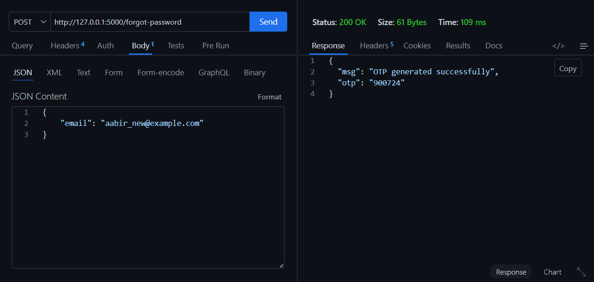
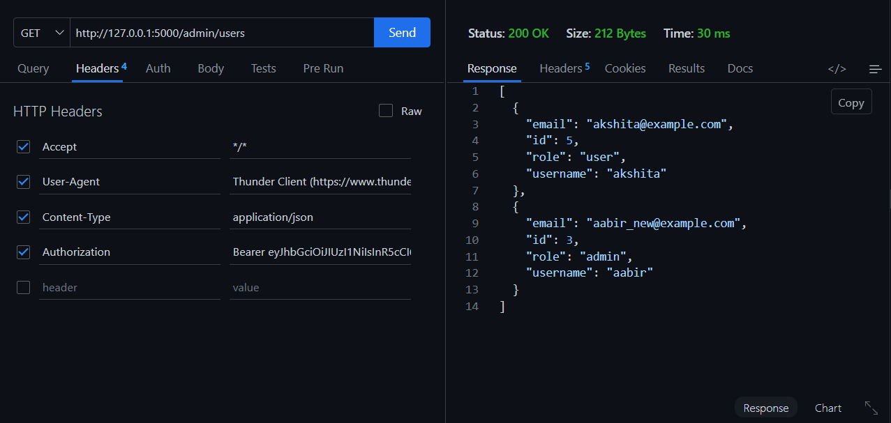

# 🔐 Secure Authentication System

> A production-inspired RESTful Authentication API built with **Flask**,
> **PostgreSQL**, and **JWT (JSON Web Tokens)** featuring secure
> authentication, password recovery via OTP, and Role-Based Access
> Control (RBAC).

<p align="center">


</p>

------------------------------------------------------------------------

## 📑 Table of Contents

-   Overview
-   Features
-   Tech Stack
-   System Architecture
-   Authentication Flow
-   Project Structure
-   Installation
-   Environment Variables
-   Database Migration
-   Running the Application
-   API Endpoints
-   Security Features
-   Testing
-   Future Improvements
-   Author

------------------------------------------------------------------------

# 📌 Overview

Secure Authentication System is a RESTful backend application developed
using Flask and PostgreSQL. It provides a secure authentication and
authorization system using JWT, password hashing with Bcrypt, password
recovery via OTP, and Role-Based Access Control (RBAC).

This project was built to demonstrate backend development concepts
commonly used in production applications.

## 🌐 Live API

**Base URL**

https://secure-authentication-system-w0ds.onrender.com

**Health Check**

GET /

Returns:

```json
{
  "message": "Secure Authentication System API is running!"
}
```

------------------------------------------------------------------------

# ✨ Features

## 🔐 Authentication

-   User Registration
-   User Login
-   JWT Access Tokens
-   JWT Refresh Tokens
-   Protected Routes
-   Secure Logout
-   Change Password

## 👤 User Profile

-   View Profile
-   Update Profile
-   Delete Profile

## 🔑 Password Recovery

-   Generate OTP
-   Verify OTP
-   Reset Password

## 👑 Role-Based Access Control

-   Admin-only APIs
-   View All Users
-   Promote/Demote Users
-   Delete Users

## 🛡 Security

-   Password Hashing using Bcrypt
-   JWT Authentication
-   Role-Based Authorization
-   PostgreSQL Database
-   Flask-Migrate Database Versioning

------------------------------------------------------------------------

# 🛠 Tech Stack

  Category             Technology
  -------------------- --------------------
  Language             Python
  Framework            Flask
  Database             PostgreSQL
  ORM                  SQLAlchemy
  Authentication       Flask-JWT-Extended
  Password Security    Flask-Bcrypt
  Database Migration   Flask-Migrate
  Testing              Thunder Client

------------------------------------------------------------------------

# 🏗 System Architecture



------------------------------------------------------------------------

# 🔄 Authentication Flow



------------------------------------------------------------------------

# 📂 Project Structure

``` text
SECURE AUTHENTICATION SYSTEM
│
├── migrations/
├── services/
├── tests/
├── utils/
│   ├── __init__.py
│   └── decorators.py
│
├── app.py
├── config.py
├── extensions.py
├── models.py
├── routes.py
├── requirements.txt
├── README.md
├── .gitignore
└── .env (local only, not committed)
```

------------------------------------------------------------------------

# 🚀 Installation

``` bash
git clone https://github.com/aabirbhowmik/secure-authentication-system.git
cd secure-authentication-system
python -m venv venv
```

Activate virtual environment

Windows

``` bash
venv\Scripts\activate
```

Linux/macOS

``` bash
source venv/bin/activate
```

Install dependencies

``` bash
pip install -r requirements.txt
```

------------------------------------------------------------------------

# ⚙ Environment Variables

Create a `.env` file.

``` env
SECRET_KEY=your_secret_key
JWT_SECRET_KEY=your_jwt_secret_key
DATABASE_URL=your_postgresql_database_url
```

------------------------------------------------------------------------

# 🗄 Database Migration

``` bash
flask --app app db init
flask --app app db migrate -m "Initial Migration"
flask --app app db upgrade
```

------------------------------------------------------------------------

# ▶ Run the Application

``` bash
python app.py
```

Server:

``` text
http://127.0.0.1:5000
```

------------------------------------------------------------------------

# 📖 API Endpoints

## Authentication

  Method   Endpoint
  -------- ------------------
  POST     /register
  POST     /login
  POST     /refresh
  POST     /logout
  POST     /change-password

## Password Recovery

  Method   Endpoint
  -------- ------------------
  POST     /forgot-password
  POST     /verify-otp
  POST     /reset-password

## User

  Method   Endpoint
  -------- ----------
  GET      /profile
  PUT      /profile
  DELETE   /profile

## Admin

  Method   Endpoint
  -------- ---------------------------------
  GET      /admin/users
  PUT      /admin/users/`<id>`{=html}/role
  DELETE   /admin/users/`<id>`{=html}

------------------------------------------------------------------------

# 🔒 Security Features

-   JWT Authentication
-   Access & Refresh Tokens
-   Password Hashing (Bcrypt)
-   Role-Based Access Control (RBAC)
-   OTP-Based Password Reset
-   Protected Routes

------------------------------------------------------------------------

# 🧪 Testing

The API can be tested using:

-   Thunder Client
-   Postman

------------------------------------------------------------------------

# 📸 API Screenshots

## 🔑 Login



---

## 👤 User Profile



---

## 🔐 Forgot Password (OTP)



---

## 👑 Admin - View All Users (RBAC)



------------------------------------------------------------------------

# 🚀 Future Improvements

-   Email-based OTP delivery
-   Swagger / OpenAPI documentation
-   Docker support
-   CI/CD Pipeline
-   Unit & Integration Tests

------------------------------------------------------------------------

# 👨‍💻 Author

**Aabir Bhowmik**

GitHub: https://github.com/aabirbhowmik

If you found this project useful, consider giving it a ⭐ on GitHub.